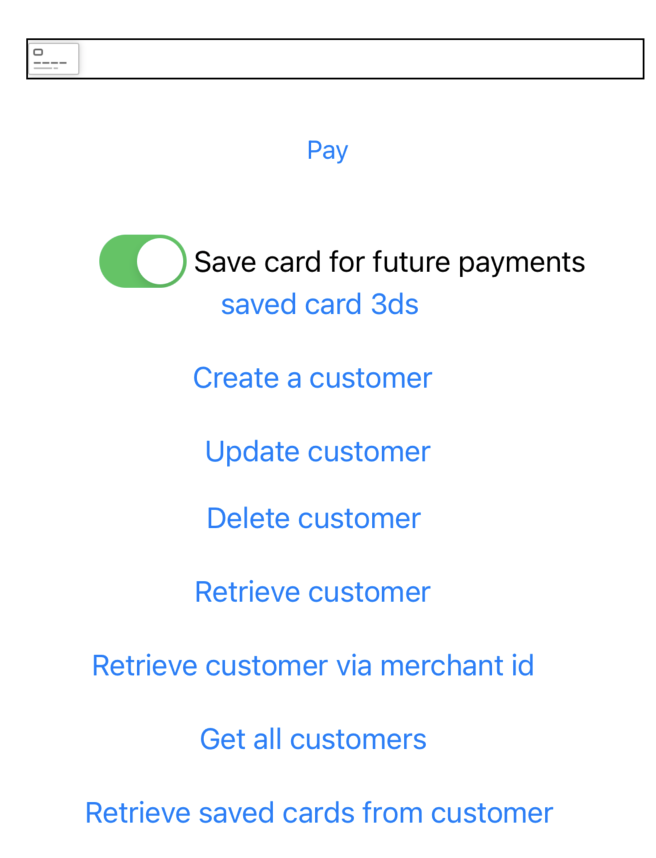

# Customers API

Our customers API allows you to securely save customer data and payment methods. In order to associate customer's
payment method for future payments you have to provide customer UUID in the transaction params, details below.

<figure><figcaption></figcaption></figure>

### Your backend <a href="#user-content-your-backend" id="user-content-your-backend"></a>

In order to operate with our Customer API you have to obtain access token and forward to your mobile app.

Here is example how to create access token with your backend:

POST request on endpoint [https://ipgtest.monri.com/v2/oauth](https://ipgtest.monri.com/v2/oauth) Body:

```json
{
  "client_id": "Authenticity token",
  "client_secret": "Merchant key",
  "scopes": [
    "customers",
    "payment-methods"
  ],
  "grant_type": "client_credentials"
}
```

Response example:

```json
{
  "access_token": "*********************",
  "token_type": "Bearer",
  "expires_in": 900,
  "status": "approved"
}
```

### ViewController setup <a href="#user-content-viewcontroller-setup" id="user-content-viewcontroller-setup"></a>

Create MonriApi instance:

```swift
 let authenticityToken = "available on merchant's dashboard";
 lazy var monri: MonriApi = {
        [unowned self] in
        return MonriApi(self.navigationController!, options: MonriApiOptions(authenticityToken: authenticityToken, developmentMode: true));
    }()
```

### Create a customer <a href="#user-content-create-a-customer" id="user-content-create-a-customer"></a>

In order to create a `Customer` you’ve to provide:

* access token
* `CustomerData`

```swift
//...
let accessToken = "Bearer *********************" //token from backend

let customerRequestBody = CustomerData(
                merchantCustomerUuid: "merchantUuid, optional if you want to use your own UUID",
                description: "description",
                email: "harun.kolos@monri.com",
                name: "Harun",
                phone: "00387000111",
                metadata: ["a": "b", "c": "d"],
                zipCode: "71000",
                city: "Sarajevo",
                address: "Džemala Bijedića 2",
                country: "BA"
        )

let createCustomerParams = CreateCustomerParams(accessToken: accessToken, customerData: customerRequestBody)
            self.monri.customers().create(createCustomerParams) { (result: CustomerResult) in
                switch (result) {
                case .result(let customer):
                    //...
                case .error(let customerError):
                    //...
                }

            }
//...
```

### Update a customer <a href="#user-content-update-a-customer" id="user-content-update-a-customer"></a>

In order to update a `Customer` you’ve to provide:

* access token
* `UpdateCustomerParams`

```swift
//...
let customerRequestBody = CustomerData(
                description: "new description",
                email: "harun.kolos.update@monri.com",
                name: "Harun Update",
                phone: "00387000111"
        )
        
let customerUpdateRequest = UpdateCustomerParams(
                        customerData: customerRequestBody,
                        customerUuid: "customer uuid",
                        accessToken: "accessToken"
                )

self.monri.customers().update(customerUpdateRequest) { (result: CustomerResult) in
    switch (result) {
    case .result(let customerUpdateResponse):
        //...
    case .error(let customerUpdateError):
        //...
    }

}
//...
```

### Delete a customer <a href="#user-content-delete-a-customer" id="user-content-delete-a-customer"></a>

In order to delete a `Customer` you’ve to provide:

* access token
* `DeleteCustomerParams`

```swift
//...
let customerDeleteRequest = DeleteCustomerParams(
                        customerUuid: "customer uuid",
                        accessToken: "accessToken"
                )
                
self.monri.customers().delete(customerDeleteRequest) { result in
    switch (result) {
    case .result(let customerDeleteResponse):
        //...
    case .error(let message):
        //...
    }
}
//...
```

### Retrieve a customer <a href="#user-content-retrieve-a-customer" id="user-content-retrieve-a-customer"></a>

In order to retrieve a `Customer` you’ve to provide:

* access token
* `RetrieveCustomerParams`

```swift
//...
let customerRetrieveRequest = RetrieveCustomerParams(
                        customerUuid: "customer uuid",
                        accessToken: "accessToken"
                )

self.monri.customers().get(customerRetrieveRequest) { result in
    switch (result) {
    case .result(let customerResponse):
        //...
    case .error(let message):
        //...
    }
}
//...
```

### Retrieve a customer via Merchant Uuid <a href="#user-content-retrieve-a-customer-via-merchant-uuid" id="user-content-retrieve-a-customer-via-merchant-uuid"></a>

In order to retrieve a `Customer` via Merchant UUID you’ve to provide:

* access token
* `RetrieveCustomerViaMerchantCustomerUuidParams`

```swift
//...
let customerRetrieveMerchantIdRequest = RetrieveCustomerViaMerchantCustomerUuidParams(
                        accessToken: "accessToken",
                        merchantCustomerUuid: "merchantCustomerUuid"
                )

self.monri.customers().getViaMerchantCustomerUuid(customerRetrieveMerchantIdRequest) { result in
    switch (result) {
    case .result(let customerResponse):
        //...
    case .error(let message):
        //...
    }
}
//...
```

### Retrieve all customers <a href="#user-content-retrieve-all-customers" id="user-content-retrieve-all-customers"></a>

In order to get all customers you’ve to provide:

* access token

```swift
//...
self.monri.customers().all("accessToken") { result in
    switch (result) {
    case .result(let customerAllResponse):
        //...
    case .error(let message):
        //...
    }
}
//...
```

### Retrieve customer payment methods <a href="#user-content-retrieve-customer-payment-methods" id="user-content-retrieve-customer-payment-methods"></a>

In order to retrieve all customer payment methods you’ve to provide:

* access token
* `CustomerPaymentMethodParams`

```swift
//...
let request = CustomerPaymentMethodParams(
                   customerUuid: "customer UUID",
                   limit: 20,
                   offset: 0,
                   accessToken: "accessToken"
                )

self.monri.customers().paymentMethods(request) { result in
    switch (result) {
    case .result(let paymentMethodResponse):
        //...
    case .error(let message):
        //....
    }
}
//...
```

### Confirm payment with customer UUID - save card for future payments <a href="#user-content-confirm-payment-with-customer-uuid---save-card-for-future-payments" id="user-content-confirm-payment-with-customer-uuid---save-card-for-future-payments"></a>

In order to associate customer's payment method for future payments, beside customer's data which is optional, you have
to provide also:

* created customer UUID
* clientSecret - please see our section
  about [Payment API Integration](payment-api-integration.md)

```swift
let card = Card(number: "4111 1111 1111 1111", cvc: "123", expMonth: 10, expYear: 2031, tokenizePan: true).toPaymentMethodParams()

let customerParams = CustomerParams(
              customerUuid: "created customer uuid",
              email: "customer email",
              fullName: "customer name",
              address: "customer address",
              city: "customer city",
              zip: "customer zipCode",
              phone: "customer phone",
              country: "customer country"
      )

let confirmPaymentParams = ConfirmPaymentParams(paymentId: "clientSecret",
                    paymentMethod: card,
                    transaction: TransactionParams.create()
                            .set(customerParams: customerParams)
                            .set("order_info", "iOS SDK payment session")
            )


self.monri.confirmPayment(confirmPaymentParams) { result in
                switch (result) {
                case .result(let r):
                    //...
                case .error(let e):
                    //...
                case .declined(let d):
                    //...
                case .pending:
                    //...
                }
            }
);
```
